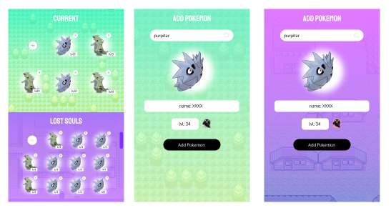
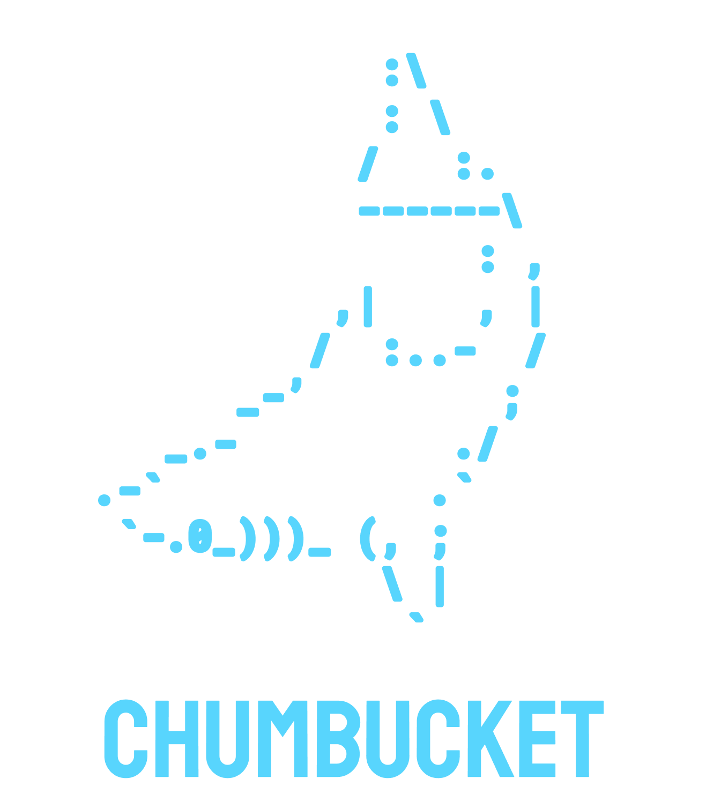

# Nuzlocke Helper

<p align="center">
</p>

to start the project run

```
$ npm run start; 
```

## Video explaining it here

- Part 1: https://youtu.be/G2hEtXOzw3I
- Part 2: https://youtu.be/LD8a5MQNa9E
- Part 3: https://youtu.be/lbG0Hv_ADa8

# Template used 

<p align="center">
</p>
<p align="center">a kit to build quick demo apps and test ideas (chumming the water so to speak )</p>
<hr>
<p align="center">
<a href="https://opensource.org/licenses/MIT">
  
</a>
</p>

- 🖼️ UI = [nanohtml](https://github.com/choojs/nanohtml)
- 🍖 Store = [Obake.js](https://github.com/stagfoo/obake)
- 🦴 Router = [Page.js](https://visionmedia.github.io/page.js/)
- 🍹 Styles = Just Javascript and strings [Joro](https://github.com/stagfoo/joro).